###<a href="http://arxiv.org/abs/1605.05396">Generative Adversarial Text-to-Image Synthesis</a>
Scott Reed, Zeynep Akata, Xinchen Yan, Lajanugen Logeswaran, Bernt Schiele, Honglak Lee

This is the code for our ICML 2016 paper on text-to-image synthesis using conditional GANs. You can use it to train and sample from  text-to-image models. The code is adapted from the excellent [dcgan.torch](https://github.com/soumith/dcgan.torch).

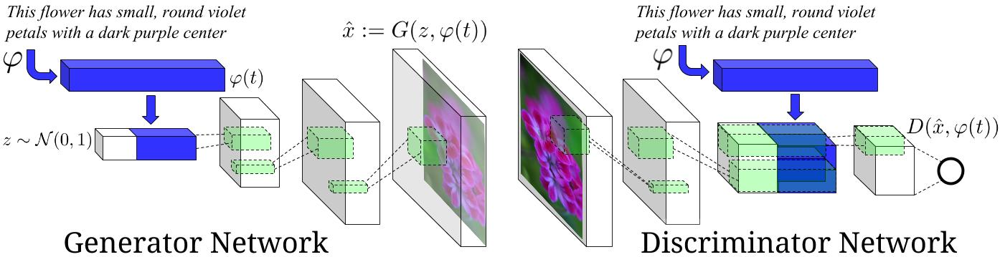

####Setup Instructions

You will need to install [Torch](http://torch.ch/docs/getting-started.html), CuDNN, and the [display](https://github.com/szym/display) package.

####How to train a text to image model:

1. Download the [birds](https://drive.google.com/file/d/0B0ywwgffWnLLLUc2WHYzM0Q2eWc/view?usp=sharing) and [flowers](https://drive.google.com/file/d/0B0ywwgffWnLLMl9uOU91MV80cVU/view?usp=sharing) and [COCO](https://drive.google.com/open?id=0B0ywwgffWnLLamltREhDRjlaT3M) caption data in Torch format.
2. Download the [birds](http://www.vision.caltech.edu/visipedia/CUB-200-2011.html) and [flowers](http://www.robots.ox.ac.uk/~vgg/data/flowers/102) and [COCO](http://mscoco.org/dataset/#download) image data.
3. Download the text encoders for [birds](https://drive.google.com/open?id=0B0ywwgffWnLLU0F3UHA3NzFTNEE) and [flowers](https://drive.google.com/open?id=0B0ywwgffWnLLZUt0UmQ1LU1oWlU) and [COCO](https://drive.google.com/open?id=0B0ywwgffWnLLeVNmVVV6OHBDUFE) descriptions.
4. Modify the `CONFIG` file to point to your data and text encoder paths.
5. Run one of the training scripts, e.g. `./scripts/train_cub.sh`

####How to generate samples:

* For flowers: `./scripts/demo_flowers.sh`. Add text descriptions to `scripts/flowers_queries.txt`.
* For birds: `./scripts/demo_cub.sh`.
* For COCO (more general images): `./scripts/demo_coco.sh`. 
* An html file will be generated with the results:


 caption             |  image example
:-------------------------:|:-------------------------:
the petals of the flower are pink in color and have a yellow center. |  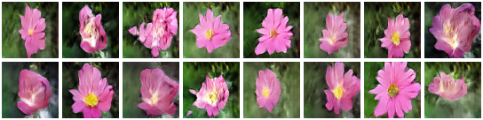
this flower is pink and white in color, with petals that are multi colored. |  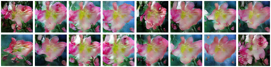
the geographical shapes of the bright purple petals set off the orange stamen and filament and the cross shaped stigma is beautiful. |  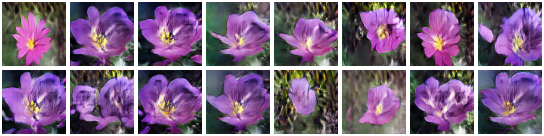
the purple petals have shades of white with white anther and filament |  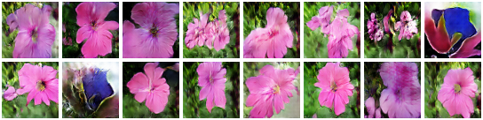
this flower has large pink petals and a white stigma in the center |  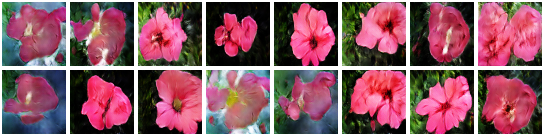
this flower has petals that are pink and has a yellow stamen |  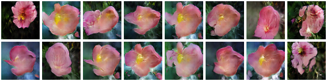
a flower with short and wide petals that is light purple. |  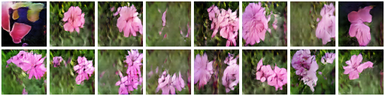
this flower has small pink petals with a yellow center. |  
this flower has large rounded pink petals with curved edges and purple veins. |  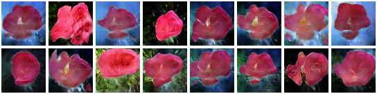

 caption             |  image example
:-------------------------:|:-------------------------:
the medium sized bird has a dark grey color, a black downward curved beak, and long wings. |  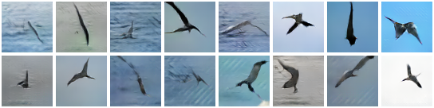
the bird is dark grey brown with a thick curved bill and a flat shaped tail. |  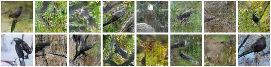
bird has brown body feathers, white breast feathers and black beak |  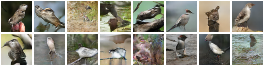
this bird has a dark brown overall body color, with a small white patch around the base of the bill. |  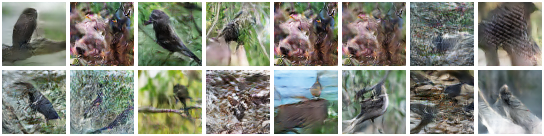
the bird has very long and large brown wings, as well as a black body and a long black beak. |  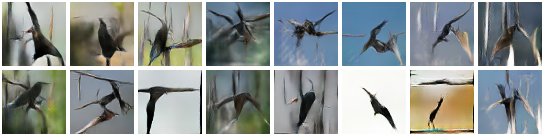
it is a type of albatross with black wings, tail, back and beak, and has a white ring at the base of its beak. |  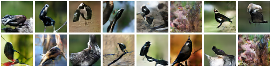
this bird has brown plumage and a white ring at the base of its long, curved brown beak. |  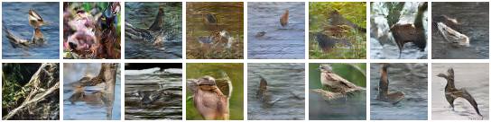
the entire body is dark brown, as is the bill, with a white band encircling where the bill meets the head. |  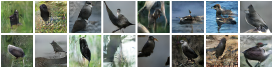
this bird is gray in color, with a large curved beak. |  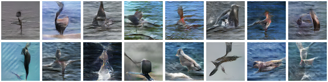


####Pretrained models:

* [CUB GAN-INT-CLS](https://drive.google.com/open?id=0B0ywwgffWnLLSW84ZXRjdXhObzQ)
* [Flowers GAN-INT-CLS](https://drive.google.com/open?id=0B0ywwgffWnLLV0U4MGwzZ2JKT3c)
* [COCO GAN-CLS](https://drive.google.com/open?id=0B0ywwgffWnLLT0JqcEFrOG1iVVk)

####How to train a text encoder from scratch:

* You may want to do this if you have your own new dataset of text descriptions.
* For flowers and birds: follow the instructions [here](https://github.com/reedscot/cvpr2016).
* For MS-COCO: `./scripts/train_coco_txt.sh`.

####Citation

If you find this useful, please cite our work as follows:

```
@inproceedings{reed2016generative,
  title={Generative Adversarial Text-to-Image Synthesis},
  author={Scott Reed and Zeynep Akata and Xinchen Yan and Lajanugen Logeswaran and Bernt Schiele and Honglak Lee},
  booktitle={Proceedings of The 33rd International Conference on Machine Learning},
  year={2016}
}
```
